# Civil Aircraft Wing-Box Structural Design, FEA & Sizing

**CATIA V5 · ANSYS Mechanical · Python · analytical structural mechanics**

This project covers the structural design and analysis of a civil aircraft wing box. It combines a CATIA V5 assembly, first-principles load calculations, ANSYS static and eigenvalue-buckling analysis, analytical-to-FEA correlation, shell-thickness sizing, and Python post-processing.

<p align="center">
  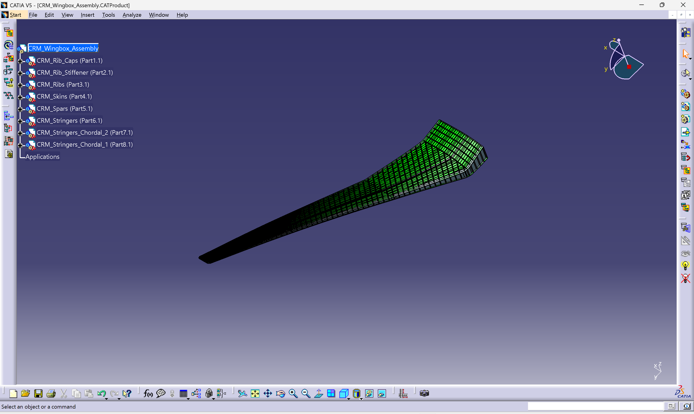
</p>

## Key outcomes

| Result | Baseline / reference | Final comparison | Outcome |
|---|---:|---:|---|
| Aerodynamic load sanity check | BDF half-wing force: 967.011 kN | `qSCL/2`: 1,051.056 kN | **7.996% difference** |
| Analytical–FEA deformation correlation | Analytical: 2.7969 m | ANSYS: 2.9277 m | **4.68% difference** |
| Shell-thickness trade study | 9,679.1 kg | 8,601.0 kg | **11.14% mass reduction** |
| Sizing mass saving | — | 1,078.1 kg | Target exceeded |
| Baseline yield screen | 201.87 MPa peak stress | 420 MPa material yield | FoS **2.08** |
| Mesh sensitivity | 8,159 elements | 57,260 elements | Two-level comparison |

During the final project review, the 0.89-thickness sizing case was completed and the results were reassessed. It achieved an 11.14% mass reduction, but the lower shell thickness increased deformation by 12.95% and peak von Mises stress by 14.16%, while the first buckling factor fell by 21.01%. The reduced case is therefore presented as a sizing trade study rather than a final accepted configuration. The mesh results are similarly reported as a two-level sensitivity study, with a third level required before formal convergence is claimed.

## Engineering workflow

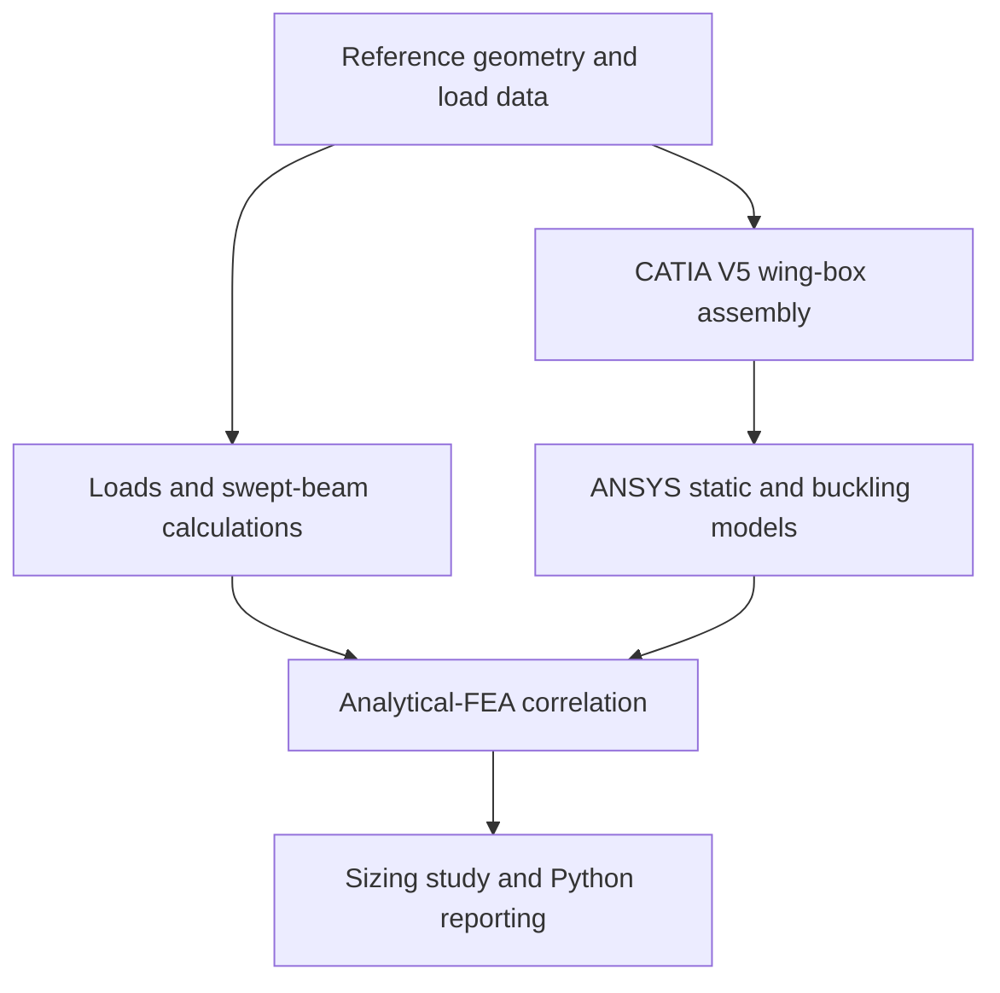

## 1. CAD assembly in CATIA V5

The component surfaces were organised into a single wing-box product containing:

- rib caps and rib stiffeners;
- ribs and spars;
- upper and lower skins;
- spanwise and chordwise stringer sets.

The component files shared a common coordinate system, so they retained their correct relative positions in the assembly. The product tree was renamed clearly, and parametric outboard-skin offset features were added for controlled surface changes.

<table>
  <tr>
    <td width="50%">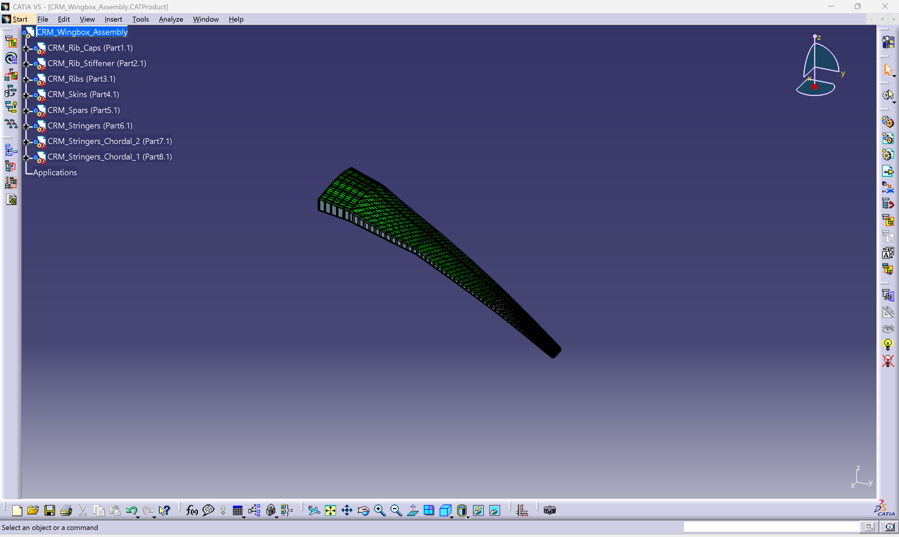</td>
    <td width="50%">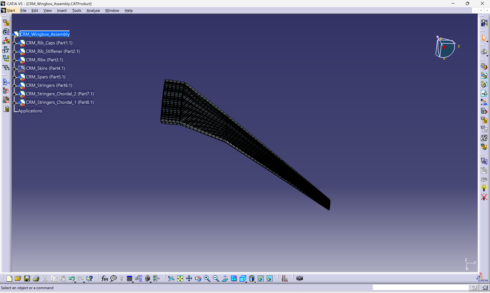</td>
  </tr>
  <tr>
    <td align="center"><em>Complete component assembly</em></td>
    <td align="center"><em>Internal load-carrying structure</em></td>
  </tr>
</table>

The full-resolution evidence is in [`02_catia_cad/`](02_catia_cad/).

## 2. Flight condition and structural model

| Input | Value |
|---|---:|
| Mach number | 0.85 |
| Altitude | 37,000 ft |
| Lift coefficient | 0.50 |
| Reference wing area | 383.74 m² |
| Semi-span | 29.3805 m |
| Quarter-chord sweep | 35° |
| Young's modulus | 68.948 GPa |
| Poisson's ratio | 0.32 |
| Density | 2,768 kg/m³ |

The independent load check uses

$$q=\frac{1}{2}\rho V^2, \qquad L_{1/2}=\frac{qSC_L}{2}$$

at the selected cruise condition. The theoretical half-wing lift is **1,051.056 kN**, compared with **967.011 kN** from the aerodynamic FORCE-card total. The difference is **7.996%**, providing an independent check on the applied aerodynamic loading.

Signed aerodynamic and inertia components give the following root actions for the half-wing reference case:

| Quantity | Result |
|---|---:|
| Net root vertical load | 632.210 kN |
| Root bending moment | 10.846 MN·m |
| Root torsion | −0.295 MN·m |

The swept equivalent-beam model includes spanwise section variation, bending, shear, and torsion. The equations, inputs, and editable assumptions are retained in [`01_hand_calculations/wingbox_hand_calculations.xlsx`](01_hand_calculations/wingbox_hand_calculations.xlsx).

The analytical model is used for preliminary sizing and response correlation. The reported baseline and reduced-thickness masses in the sections below are taken from the solved ANSYS shell models.

## 3. Baseline static structural analysis

The baseline ANSYS model uses shell elements with the imported nodal loads, surface loads, and root constraints. The solved mesh contains **8,159 elements** and **6,647 nodes**.

<p align="center">
  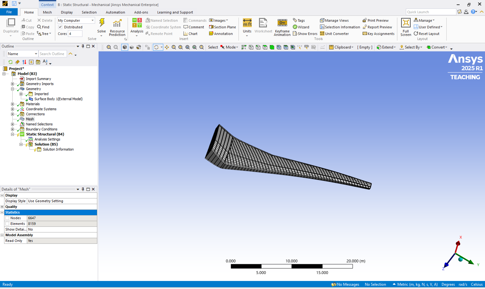
</p>

| Baseline result | Value |
|---|---:|
| Wing-box mass | 9,679.1 kg |
| Maximum total deformation | 2.9277 m |
| Maximum equivalent stress | 201.87 MPa |
| Yield factor of safety | 2.08 |

<table>
  <tr>
    <td width="50%">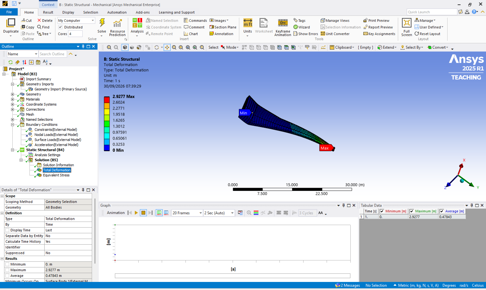</td>
    <td width="50%">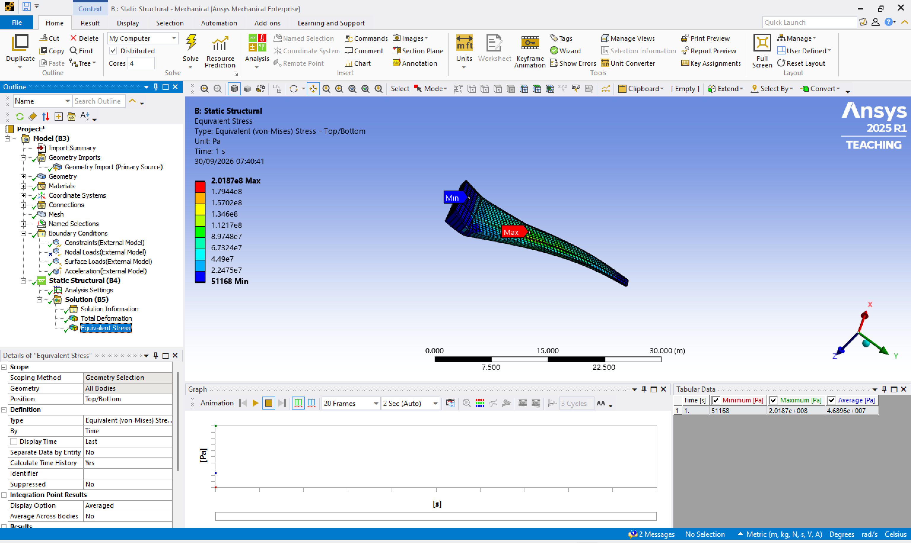</td>
  </tr>
  <tr>
    <td align="center"><em>Total deformation: 2.9277 m</em></td>
    <td align="center"><em>Peak equivalent stress: 201.87 MPa</em></td>
  </tr>
</table>

## 4. Analytical–FEA correlation

The analytical model predicts **2.7969 m** total tip deformation. Against the ANSYS result of **2.9277 m**, the difference is:

$$\frac{|2.9277-2.7969|}{2.7969}\times100=\mathbf{4.68\%}$$

This is within the project's 8% correlation target. Total deformation is used for the main comparison because it gives a consistent global response in both models. The nominal beam stress and local FEA peak stress are reported separately.

The remaining difference is expected because the analytical model uses a swept equivalent-beam idealisation, while ANSYS represents the wing box with shell elements and more detailed sectional stiffness, load distribution, and local constraint effects.

<p align="center">
  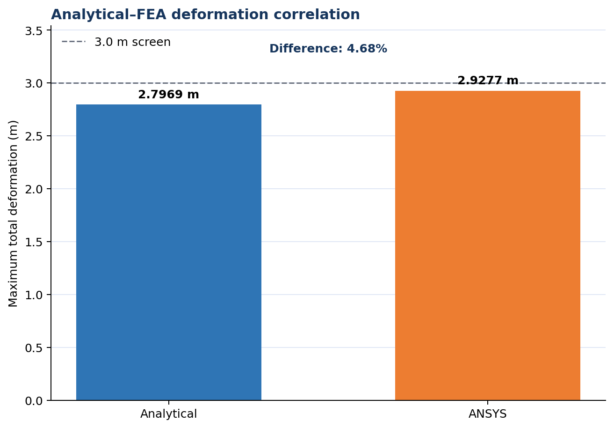
</p>

## 5. Eigenvalue buckling assessment

The linked eigenvalue study was used to identify the first elastic instability modes under the reference preload:

| Mode | Baseline load factor |
|---:|---:|
| 1 | 0.45096 |
| 2 | 0.96238 |

<table>
  <tr>
    <td width="50%">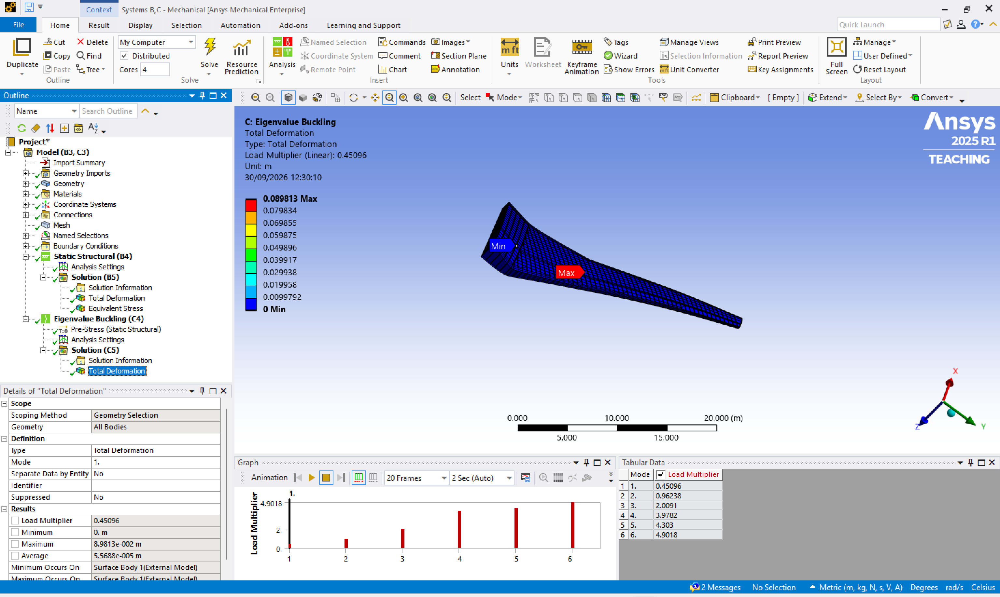</td>
    <td width="50%">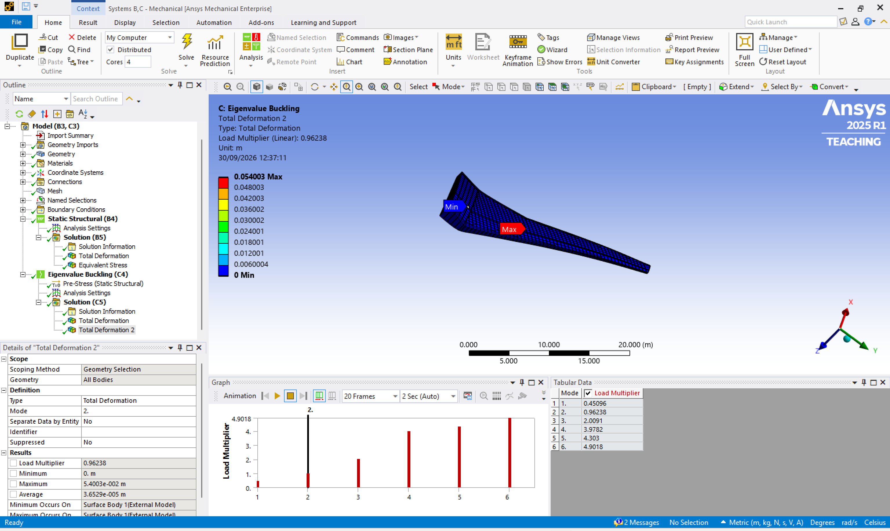</td>
  </tr>
</table>

With a first eigenvalue of **0.45096**, the baseline model does not meet the selected linear-buckling screening criterion at the applied reference load. This identifies local stability as a governing constraint for the next iteration, with possible changes to stringer pitch, rib spacing, local skin thickness, and stiffener geometry.

## 6. Mesh sensitivity study

A separate verification load case was solved at two discretisation levels:

| Mesh | Nodes | Elements | Max deformation | Max stress |
|---|---:|---:|---:|---:|
| Coarse | 6,647 | 8,159 | 0.14527 m | 10.663 MPa |
| Refined | 52,357 | 57,260 | 0.16319 m | 11.954 MPa |
| Change | — | — | **+12.34%** | **+12.11%** |

<p align="center">
  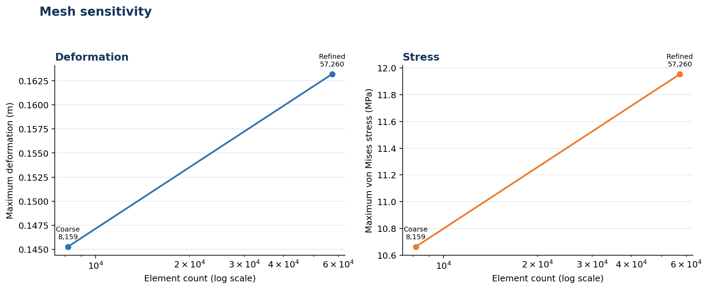
</p>

These results show the response change between the two meshes. A third mesh level is planned before formal convergence is claimed. The four full-resolution contour plots and CSV data are in [`04_mesh_sensitivity/`](04_mesh_sensitivity/).

## 7. Shell-thickness sizing trade study

For a uniform-thickness trade study, the 17 imported shell-property thicknesses were scaled to **0.89** of baseline and the static and buckling analyses were re-solved.

| Metric | Baseline | Reduced thickness | Change |
|---|---:|---:|---:|
| Mass | 9,679.1 kg | 8,601.0 kg | **−11.14%** |
| Maximum deformation | 2.9277 m | 3.3068 m | +12.95% |
| Maximum von Mises stress | 201.87 MPa | 230.46 MPa | +14.16% |
| Yield factor of safety | 2.08 | 1.82 | −12.42% |
| First buckling factor | 0.45096 | 0.3562 | −21.01% |

<p align="center">
  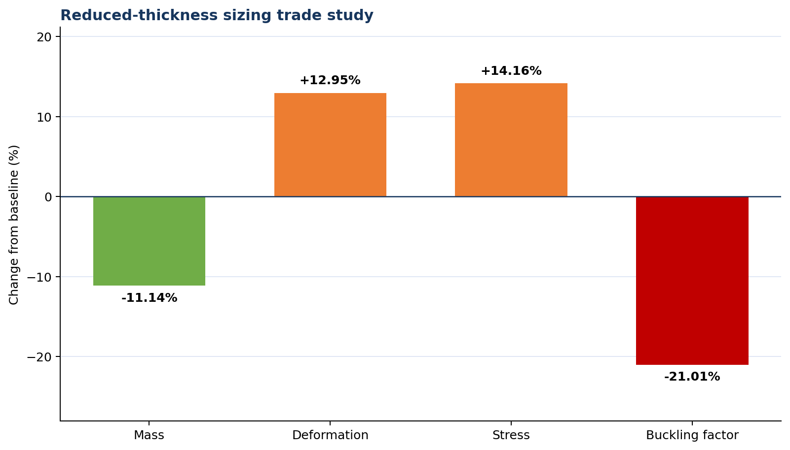
</p>

<table>
  <tr>
    <td width="50%">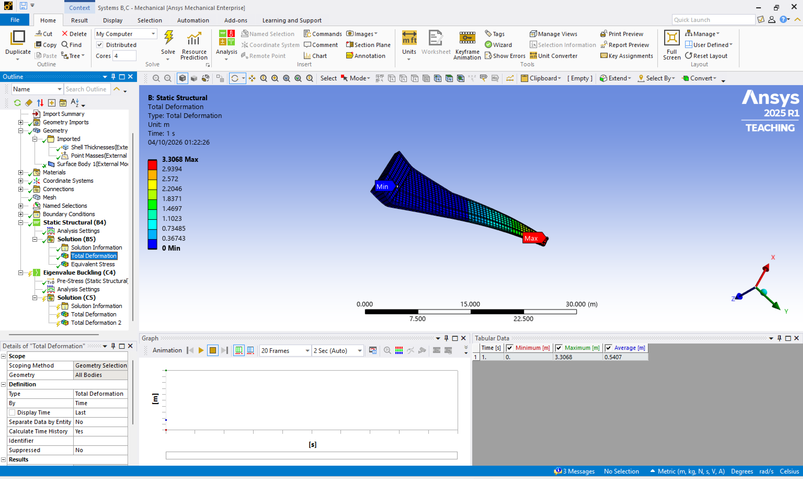</td>
    <td width="50%">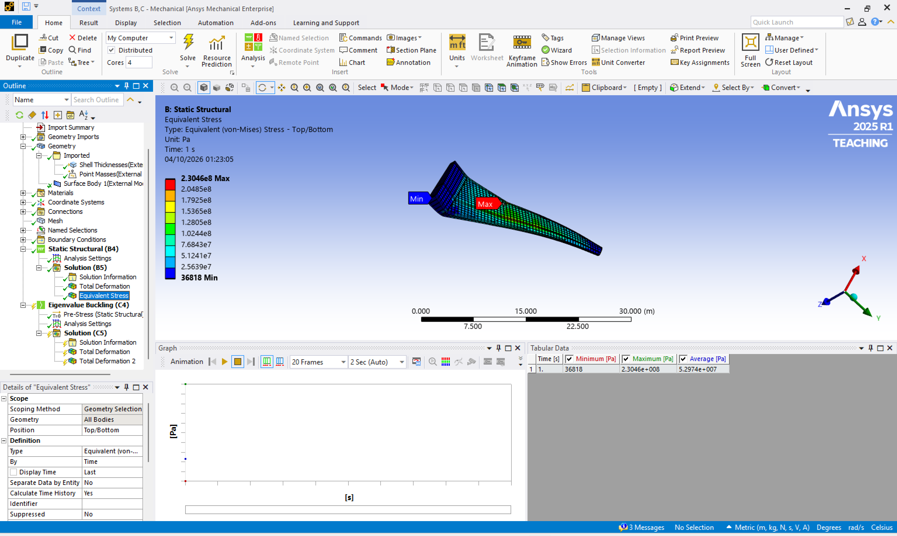</td>
  </tr>
  <tr>
    <td align="center"><em>Reduced-thickness deformation: 3.3068 m</em></td>
    <td align="center"><em>Reduced-thickness stress: 230.46 MPa</em></td>
  </tr>
</table>

The 0.89-thickness case reduced the ANSYS shell mass from **9,679.1 kg** to **8,601.0 kg**, a reduction of **11.14%**. It retained a yield factor of safety of **1.82**, but maximum deformation increased to **3.3068 m**, above the **3.0 m** project screen, and the first buckling factor fell to **0.3562**. The result is therefore treated as a trade study rather than an accepted or optimised final configuration. A further iteration would redistribute material towards the panels governing stiffness and buckling rather than applying another uniform reduction.

## 8. Preliminary fatigue and damage-tolerance screen

The workbook also contains a parameterised fatigue screen using a Goodman mean-stress correction, Basquin S–N relation, Miner damage, and Paris-law crack growth. With the current screening inputs:

| Quantity | Result |
|---|---:|
| Maximum / minimum nominal cycle stress | 120 / 12 MPa |
| Goodman-corrected amplitude | 62.212 MPa |
| Basquin life | 5.696 × 10⁹ cycles |
| Miner damage for 60,000 cycles | 1.053 × 10⁻⁵ |
| Initial / critical crack length | 0.5 / 11.014 mm |
| Paris-law propagation life | 714,220 cycles |
| Inspection interval with SF = 4 | 178,555 cycles |

This is a preliminary screening calculation. A detailed assessment would use programme-specific material data, load spectra, crack geometry, and local stresses.

## 9. Python automation

[`05_python_automation/`](05_python_automation/) contains the tested Python scripts used to generate:

- ISA cruise-condition and `qSCL` calculations;
- signed load balance and root actions;
- analytical–FEA correlation metrics;
- sizing and mesh-sensitivity comparisons;
- CSV, JSON, Markdown, and PNG outputs.

Run it with Python 3.10+:

```bash
cd 05_python_automation
python -m pip install -r requirements.txt
python run_analysis.py
python -m unittest discover -s tests -v
```

The script reads its inputs from `data/` and recreates the output tables and charts. A third mesh can be added as another row in `data/mesh_results.csv`.

## Repository layout

```text
.
├── 01_hand_calculations/   # Hand-calculation workbook and guide
├── 02_catia_cad/           # CAD evidence and component-assembly notes
├── 03_ansys_fea/           # Baseline, buckling and sizing evidence
├── 04_mesh_sensitivity/    # Two mesh levels, contours and CSV data
├── 05_python_automation/   # Reproducible calculations, tests and charts
├── EVIDENCE_INDEX.md       # Result-to-evidence map
└── README.md
```

The native CATIA and ANSYS working archives are stored separately because of their size. This repository contains the calculation workbook, Python scripts, input data, generated results, and full-resolution screenshots.

## Model and data source

The starting geometry and reference load data came from the public CRM/uCRM resources listed below. The CATIA assembly, hand calculations, ANSYS analysis and interpretation, sizing work, and Python automation were completed as part of this project.

## References

1. Brooks, T. R., Kenway, G. K. W., and Martins, J. R. R. A., “Benchmark Aerostructural Models for the Study of Transonic Aircraft Wings,” *AIAA Journal*, 56(7), 2018. [doi:10.2514/1.J056603](https://doi.org/10.2514/1.J056603)
2. University of Michigan MDO Lab, [uCRM benchmark model and structural datasets](https://mdolab.engin.umich.edu/wiki/ucrm.html).
3. Brooks, T. R., [uCRM-9 structural model data](https://data.mendeley.com/datasets/gpk4zn73xn/1), Mendeley Data, Version 1, CC BY 4.0.
4. NASA, [Common Research Model high-speed geometry](https://www.nasa.gov/common_research_model/high-speed-crm/geometry/).
